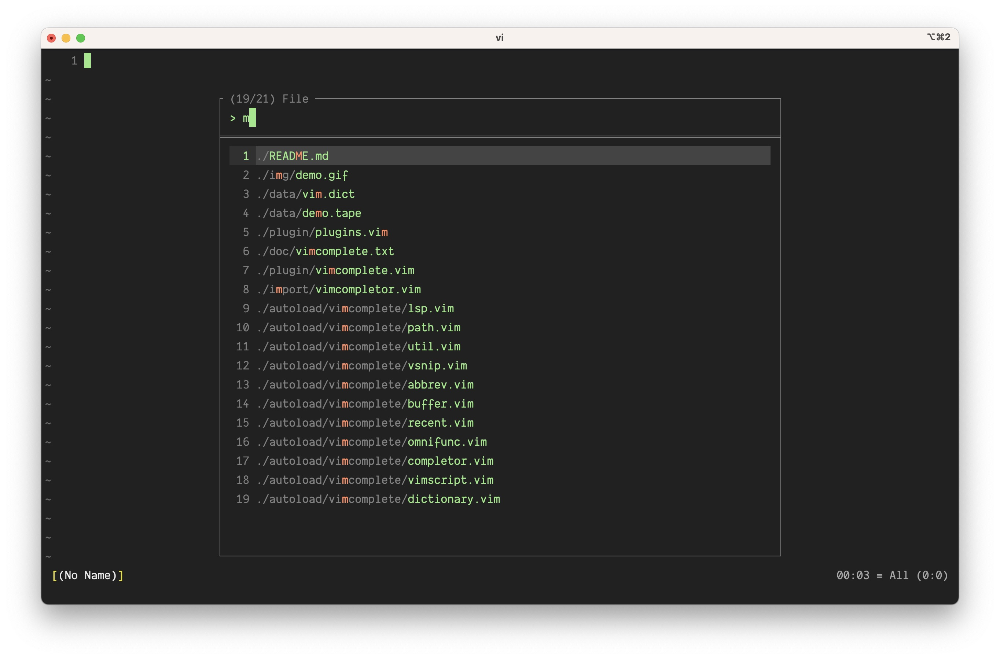

<h1 align="center"> Scope </h1>

<h4 align="center"> Minimal, fast, and async fuzzy finder for Vim. </h4>

<p align="center">
  <a href="#usage">Usage</a> •
  <a href="#requirements">Requirements</a> •
  <a href="#installation">Installation</a> •
  <a href="#configuration">Configuration</a>
</p>



There are already good implementations of this kind, such as [fuzzyy](https://github.com/Donaldttt/fuzzyy) and
[fzf](https://github.com/junegunn/fzf). This plugin, while minimal, encompasses all essential features, excluding the preview window, which I consider non-essential. The core functionality is implemented in two files, totaling approximately 300 lines of code.

<a href="#Search-Interesting-Things">Extending the functionality</a> for fuzzy searching anything is straightforward.

## Usage

Map the following functions to your favorite keys.

In the following examples, replace `<your_key>` with the desired key combination.

### Find File

Search for files in the current working directory.

```
vim9script
import autoload 'scope/fuzzy.vim'
nnoremap <your_key> <scriptcmd>fuzzy.File()<CR>
```

Search for installed Vim files.

```
vim9script
import autoload 'scope/fuzzy.vim'
nnoremap <your_key> <scriptcmd>fuzzy.File("find " .. $VIMRUNTIME .. " -type f -print -follow")<CR>
```

Use [fd](https://github.com/sharkdp/fd) instead of `find` command.

```
vim9script
import autoload 'scope/fuzzy.vim'
nnoremap <your_key> <scriptcmd>fuzzy.File('fd -tf --follow')<CR>
```

> [!NOTE]
> The `fuzzy.Find()` function accepts a string argument. Set this string to the command used for finding files. The directories are traversed by a spawned job, ensuring Vim remains responsive even when dealing with large directories.

### Live Grep

Live grep in the directory.

```
vim9script
import autoload 'scope/fuzzy.vim'
nnoremap <your_key> <scriptcmd>fuzzy.Grep()<CR>
```

> [!NOTE]
> To grep the same keyword a second time, there's no need to retype it. The prompt already contains the previous grep string as virtual text. Simply type `<Right>` or `<PgDn>` key to fill in and continue, or type over it to dismiss.

Define your own grep command.

```
vim9script
import autoload 'scope/fuzzy.vim'
nnoremap <your_key> <scriptcmd>fuzzy.Grep('grep --color=never -RESIHin --exclude="*.git*" --exclude="*.swp" --exclude="*.zwc" --exclude-dir=plugged')<CR>
```

### Switch Buffer

```
vim9script
import autoload 'scope/fuzzy.vim'
nnoremap <your_key> <scriptcmd>fuzzy.Buffer()<CR>
```

Search unlisted buffers as well.

```
vim9script
import autoload 'scope/fuzzy.vim'
nnoremap <your_key> <scriptcmd>fuzzy.Buffer(true)<CR>
```

See `autoload/scope/fuzzy.vim` for implementation.

### Others

You can map the following functions to keys.

```
vim9script
import autoload 'scope/fuzzy.vim'
```

Method|Description
------|-----------
`fuzzy.Keymap()` | Key mappings
`fuzzy.Help()` | Help topics
`fuzzy.Highlight()` | Highlight groups
`fuzzy.Window()` | Open windows
`fuzzy.Template()` | Files in `~/.vim/templates` directory
`fuzzy.CmdHistory()` | Command history
`fuzzy.Filetype()` | File types
`fuzzy.Colorscheme()` | Available color schemes
`fuzzy.GitFile()` | Git files
`fuzzy.MRU()` | `:h v:oldfiles`

See `autoload/scope/fuzzy.vim` for implementation.

### Search Interesting Things

This is just an example. To perform a fuzzy search for function definitions, classes, and other useful artifacts in Python code, add the following lines to `~/.vim/after/ftplugin/python.vim`:

```
if exists('g:loaded_scope')
    import autoload 'scope/fuzzy.vim'
    def Things()
        var things = []
        for nr in range(1, line('$'))
            var line = getline(nr)
            if line =~ '\(^\|\s\)\(def\|class\) \k\+('
                    || line =~ 'if __name__ == "__main__":'
                things->add({text: $"{line} ({nr})", linenr: nr})
            endif
        endfor
        fuzzy.FilterMenu.new("Py Things", things,
            (res, key) => {
                exe $":{res.linenr}"
                normal! zz
            },
            (winid, _) => {
                win_execute(winid, $"syn match FilterMenuLineNr '(\\d\\+)$'")
                hi def link FilterMenuLineNr Comment
            })
    enddef
    # Example mapping, replace <your_key> with your preferred key combination
    nnoremap <buffer> <your_key> <scriptcmd>Things()<CR>
endif
```

See `autoload/scope/fuzzy.vim` for inspiration.

## Requirements

- Vim version 9.1 or higher

## Installation

Install this plugin via [vim-plug](https://github.com/junegunn/vim-plug).

<details><summary><b>Show instructions</b></summary>
<br>
  
Using vim9 script:

```vim
vim9script
plug#begin()
Plug 'girishji/scope.vim'
plug#end()
```

Using legacy script:

```vim
call plug#begin()
Plug 'girishji/scope.vim'
call plug#end()
```

</details>

Install using Vim's built-in package manager.

<details><summary><b>Show instructions</b></summary>
<br>
  
```bash
$ mkdir -p $HOME/.vim/pack/downloads/opt
$ cd $HOME/.vim/pack/downloads/opt
$ git clone https://github.com/girishji/scope.vim.git
```

Add the following line to your $HOME/.vimrc file.

```vim
packadd scope.vim
```

</details>

## Configuration

Popup window appearance can be configured. `borderchars`, `borderhighlight`, `highlight`,
`scrollbarhighlight`, `thumbhighlight` and  other `:h popup_create-arguments` can be
configured using `g:ScopePopupOptionsSet()`.

To set border of popup window to `Comment` highlight group:

```
g:ScopePopupOptionsSet({borderhighlight: ['Comment']})
```

`ScopeMenuMatch` highlight group modifies the look of characters searched so far.
`ScopeMenuVirtualText` is for the virtual text in Grep window. For other groups
see `autoload/scope/fuzzy.vim`.

### Credits

Some chunks shamelessly ripped from [habamax](https://github.com/habamax/.vim/blob/master/autoload/).

**Open an issue if you encounter errors.**
